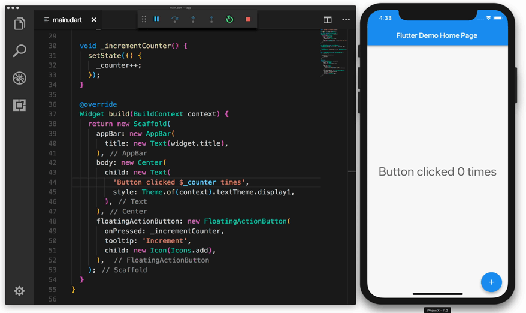

slidenumbers: true
build-lists: true

# What's new in the Google Developer World 

### 2018

---

# Most Important Topics
* Android 9 Pie
* Security Enhancements
* Android App Bundle
* Kotlin
* Jetpack
* Flutter

---

# Android 9 Pie
* Gestures
* Wind down & Do Not disturb
* Digital Well Being - Beta
* Adaptive Battery, Brightness
* App Actions
* Slices

^ Adaptive Battery: ML to prioritize access to resources 
  "App Standby buckets" "active" ... "rare".

---

---

---

# Security Enhancements

* Encrypted Android Backups
* Android biometric prompt
* New KeyStore type `StrongBox`
  `setIsStrongBoxBacked(true)`
* Import Keys ASN.1-encoded
* Privacy enhancements 

^ TEE: CPU, Storage, True RNG, Tampering
^ Key never in device hosts memory
  https://developer.android.com/training/articles/keystore
^ Privacy: Access to sensors in background is restricted

---

# APK Key Rotation

* `APK Signature Scheme v3`
* Requires Android 9

^ Finally! Helps when signing key lost/stolen
^ Signature Scheme: v1 - sign JAR, v2 sign metadata (Android 7.0), v3 APK Signer Lineage
^ Proof-of-rotaton: history of signing certificates with each ancestor attesting to the validity of its descendant
  https://www.xda-developers.com/apk-signature-scheme-v3-key-rotation/

---

# Android Protected Confirmation

* Prompt user to confirm statement
  `ConfirmationPrompt`
* Runs in Trusted Execution Environment
* Requires Pixel 3 Device

^ Prompt user to confirm statement - signs statement cryptographically
^ Extra data - cryptographic nonce (replay attacks)
^ https://developer.android.com/training/articles/keystore

---

# Android App Bundle

---

# Android App Bundle
* Smaller download size (~20% savings)
* Upload single artifact, download device specific APK
* Dynamic Delivery – On demand app features

---

# App Bundle - Details
* Manifest/Resources -> Protobuf
* Split APK per
  * CPU Architecture
  * Screen Density
  * Language

---

# App Bundle – Requirements
* Android Lollipop 5.0
* Android Studio 3.2
* App signing by Google Play

^ 
^ 
^ 
^ 

---

# Kotlin
## No news

* `inline` extension optimization
* `reified` - access generic parameter
* operators
* and more ...

---

# Android KTX
## Extensions for Kotlin

* Kotlinification
  `view.updatePadding(left = 5, right = 10)`
 * Default to inline
 * No __code golf__ API

^ Mostly Syntactical Sugar. Kotlinfication.
  https://www.youtube.com/watch?v=st1XVfkDWqk
^ Part of Jetpack

---

# Android Jetpack

*Rebranded Support Library*

* Foundation: Android KTX
* Architecture: Data Binding, Room, ViewModel, Navigation ...
* Behaviour: Notifications, Slices, ...
* UI: Animations, Emoji, Layouts, ...

^ [Jetpack](http://developer.android.com/jetpack)
^ [Architecture Components](https://developer.android.com/topic/libraries/architecture/)
^ Rebranding of existing tools: Support Library. New Namespace androidx

^ Foundation: Android KTX
^ Architecture: Data Binding, Lifecycles, Paging, Room, ViewModel, WorkManager
^ Behaviour: Notifications, Permissions, Slices
^ UI: Animations, Emoji, Layout

---

# Jetpack - Navigation

* Principles
  * Fixed starting destination (excl. Launch Screen)
  * Stack represents navigation state
* Visual navigation editor (like in XCode)

^ The Navigation Architecture simplifies the implementation of navigation between destinations in an app.
^ Types: Fragments, Activities, Navigation graphs
^ Principles: Start, Stack, Up Button never exits, up == back, deep linking
^ https://developer.android.com/topic/libraries/architecture/navigation/navigation-implementing#Create-transition
^ Android Studio 3.2

---

<!--
# Jetpack – Announcements

  * App Actions
  * Slices
--->

# Flutter
## Release Preview 2

^ Release Preview 2 - 19. Sep 2018
  Live December 4th 2018
^ Googles new Hybrid App Platform

---

# Flutter

* Dart 2, compiles to native code
* Stateful Hot Reload
* Access native SDKs and Services
* Widget Library
* Navigation, Testing, State Management

^ Not based on web technologies. Single codebase, two platforms.
^ Reloads like React Native! Highly productive!
^ CSS style UI
^ Built-in iOS/Material Design & Widgets, State Management
^ More Features than React Native! Complete Set for App. No Third Party Libs necessary.

---

---

# Announcements

* Google Duplex - Demo
* Wi-Fi RTT Indoor positioning - Demo
* Android Things
* ML on Android

^ Wi-Fi RTT

---

# Google Duplex – Demo

^ Available on Pixel 3 in 2018
	
---

# Wi-Fi RTT – Demo

* Measure Distance to AP, Devices
* `WifiRttManager`
* Runs on Pixel 2

^ measure distance to supporting Access Points and peer devices.
^ play until 6:15
^ https://developer.android.com/reference/android/net/wifi/rtt/WifiRttManager
^ https://medium.com/@rafaelmiguel.ortega/android-p-first-taste-of-rtt-support-febefb679775

---

# Android Things

* Fully Managed Device
* IoT optimized Android OS 
* Certified Managed Hardware
* Google Services

^ 50% smaller android distribution
^ Management Console
^ Automatic Updates
^ https://androidthings.withgoogle.com
^ https://www.youtube.com/watch?v=e_PI_Npb3-U

---

<!--

# Android Go Edition

* Runs on 8GB ROM
* Data Saver
* Peer-to-Peer Sharing

^ https://www.android.com/versions/go-edition/

---
-->

# ML on Android

* Neural Networks API
  C API
* TensorFlowLite
  C++ API, Java Wrapper
* ML Kit (Firebase)
  On-device & Cloud Features

^ Neural Networks API - Part of NDK
  https://developer.android.com/ndk/guides/neuralnetworks/
^ TFLite: Mobile & IoT. Run trained models with low latency on device
  https://www.tensorflow.org/lite/
^ ML Kit
  https://developers.google.com/ml-kit/
  Image Labeling, Text Recognitition (OCR), Face Detection, Barcode Scanning, Landmark detection

---

<!--
# TensorFlowLite

* Android, iOS, IoT Devices
* Requires Android NDK
* Convert models

^ https://www.tensorflow.org/lite/
^ TF->CoreML Converter
  https://github.com/tf-coreml/tf-coreml
---
-->

<!--
# Google AR Core

https://developers.google.com/ar/discover/
https://developers.google.com/ar/develop/
---
-->

# Google Cloud ML Services $$$

* Vision API
* Speech-to-Text
* Text-to-Speech
...

^ https://cloud.google.com/products/ai/

---

# The Google Ecosystem

* Android, Android Go, Android Auto, Android Things
* Chrome OS
* Wear OS
* TV OS
* Google Cloud Services

---

# Fragen ?
## `else goto Pieter`
